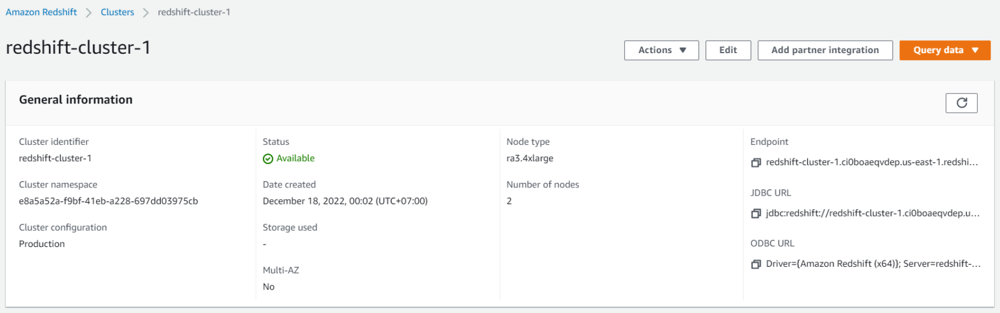
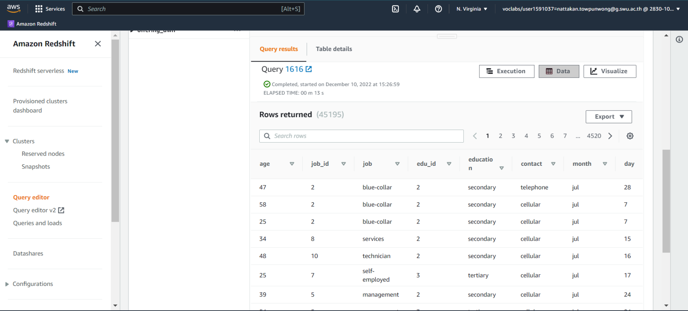

# Capstone Project - Nattakan Towpunwong 64199130043

## Project Summary
[Information Documentation](https://github.com/Plengnattakan/swu-ds525/blob/5ea194cea8a4d8005797c792f5cc2d5dd32aff47/capstone-project/capstone%20project%20doc.pdf)
<br>
__________
<br>

## Data Model

<br>

## Workflow Summary (Data Pipeline)

<br>
__________
<br>

## VDO Presentation
[](https://youtu.be/YjouRNzBQhA)
<br>
__________
<br>

## คู่มือการทำงาน
<br>

### 1. เปลี่ยน Working Directory ไปยัง capstone-project:
```sh
$ cd capstone-project
```
<br>

### 2. จัดเตรียมการเชื่อมต่อ Cloud Environment (AWS):
- ตั้งค่าการเชื่อมต่อกับ AWS
```sh
$ cat ~/.aws/credentials
```


- นำ 3 ค่าด้านล่างไป update ที่ source code สำหรับการเชื่อมต่อ AWS<br>
> - aws_access_key_id
> - aws_secret_access_key
> - aws_session_token

- source code ที่ต้องการการ update<br>
> - /datalake_s3.ipynb
> - /dags/datawarehouse.py

<br>

### 3. จัดเตรียมพื้นที่จัดเก็บบน AWS S3:
- สร้าง S3 bucket พร้อมเปิด Public Access
> - **datalake-bank-pleng**


> - **landing/** (เก็บ raw data)<br>
> - **export/** (เก็บ cleaned data)

<br>

### 4. จัดเตรียมพื้นที่จัดเก็บบน AWS RedShift สำหรับ Data Warehouse:
- สร้าง AWS Redshift พร้อมเปิด Public Access




- ทำการ update source code เพื่อให้ข้อมูลการเชื่อมต่อตรงกับ AWS Redshift ที่ทำการสร้าง
> - **dags/datawarehouse.py**

<br>

### 5. สร้าง Python virtual environment สำหรับการทำงาน (ครั้งแรก):
```sh
$ python -m venv ENV
```
<br>

### 6. Activate เพื่อเข้าสู่ Virtual environment:
```sh
$ source ENV/bin/activate
```
<br>

### 7. ทำการติดตั้ง package ที่จำเป็นในการทำงาน (ครั้งแรก):
```sh
$ pip install -r requirements.txt
```
<br>

### 8. จัดเตรียม Docker สำหรับการ run project :
- ถ้าใช้งานระบบที่เป็น Linux ให้เรารันคำสั่งด้านล่างนี้ก่อน สำหรับใช้งาน Airflow

```sh
mkdir -p ./dags ./logs ./plugins
```
```sh
echo -e "AIRFLOW_UID=$(id -u)" > .env
```

- จากนั้นให้รันคำสั่งด้านล่างเพื่อ start Docker

```sh
docker-compose up
```
<br>

### 9. Transform ข้อมูล raw data ไปเป็น Cleaned data:
- เข้าสู่ PySpark Notebook UI ด้วย port 8888 (localhost:8888)
- Run PySpark Notebook **"datalake_s3.ipynb"**


- Cleaned data จะถูกจัดเก็บบน S3 โดยมีการทำ partition
- ตัวอย่างของ cleaned data ที่ถูกจัดเก็บแบบ partition ด้วย "month"


### 10. Transform ข้อมูล เพื่อสร้าง Datawarehouse ด้วย Airflow:
- เข้าสู่ Airflow UI ด้วย port 8080 (localhost:8080)
> - Username: "airflow"<br>
> - Password: "airflow"<br>

- Airflow ถูกตั้งค่าการทำงาน ดังนี้
> - ตารางการทำงาน: "Monthly" (รายเดือน)<br>
> - วันที่เริ่มรัน: "1 ธันวาคม 2565"


- ข้อมูลจะถูก transform และ load เข้าสู่ table ใน Redshift




<br>

### 11. สร้าง Dashboard ด้วย Power BI:
- เชื่อมต่อ Power BI ไปยัง AWS Redshift ด้วยข้อมูลการเชื่อมต่อที่ตั้งค่าไว้ในขั้นตอนการสร้าง Redshift cluster
- สร้าง Dashboard เพื่อนำเสนอข้อมูลเพื่อตอบคำถามหรือแก้ไขปัญหา

https://app.powerbi.com/view?r=eyJrIjoiYjlmOTIwNmEtOTM2My00ZjJiLWJiZGMtOTVlNmM3M2MxMmNhIiwidCI6ImY5MGM0NjQ3LTg4NmYtNGI0Yy1iMmViLTU1NWRmOWVjNGU4MSIsImMiOjEwfQ%3D%3D&pageName=ReportSection

<br>
__________